# AWS Container Security Survey 2019

> Welcome to the AWS container security survey 2019!
> This is an informal survey about container security practices, 
> should take some 5 min. The survey is open until end of 2019 and 
> I plan to publish the results on GitHub.
> Thanks for your time!

The questions of the survey were:

1. [How do you run your containers on AWS?](#q1-how-do-you-run-your-containers-on-aws)
2. [Are you scanning your container images?](#q2-are-you-scanning-your-container-images)
3. [Are you scanning containers at runtime?](#q3-are-you-scanning-containers-at-runtime)
4. [How are you managing sensitive data?](#q4-how-are-you-managing-sensitive-data)
5. [Are you signing container images?](#q5-are-you-signing-container-images)
6. [How are you managing your supply chain?](#q6-how-are-you-managing-your-supply-chain)
7. [Are you using Kubernetes?](#q7-are-you-using-kubernetes)
8. [Kubernetes: network policies](#q8-kubernetes-network-policies)
9. [Kubernetes: pod security policies](#q9-kubernetes-pod-security-policies)
10. [Kubernetes: user management](#q10-kubernetes-user-management)
11. [Kubernetes: pod-level IAM roles](#q11-kubernetes-pod-level-iam-roles)
12. [Any other security-related feature of AWS you're using? Any container security tool?](#q12-any-other-security-related-feature-of-aws-youre-using-any-container-security-tool)
13. [My role in the team/organization is …](#q13-my-role-in-the-teamorganization-is-)

In detail, the questions including context, options and completion rate were
as follows:

## Q1: How do you run your containers on AWS?

*68 out of 68 people answered this question*

The container orchestrator & compute engine of choice, either what you're 
already using in prod or plan to use:

- ECS on EC2
- ECS on Fargate
- EKS on EC2
- EKS on Fargate
- DIY Kubernetes (kops, etc.)
- HashiCorp Nomad
- Docker EE

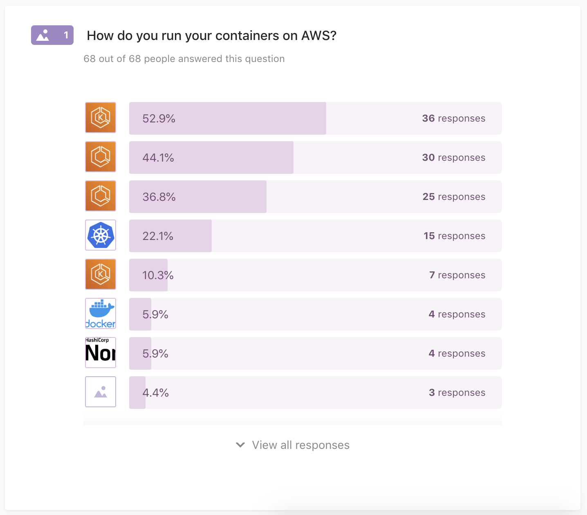

## Q2: Are you scanning your container images?

*67 out of 68 people answered this question*

Performing static container image scanning, for example, as part of the build pipeline, using:

- Native ECR scanning
- DIY Clair
- Aqua Security
- StackRox
- Sysdig Secure
- Twistlock
- Nope, not scanning images (yet)

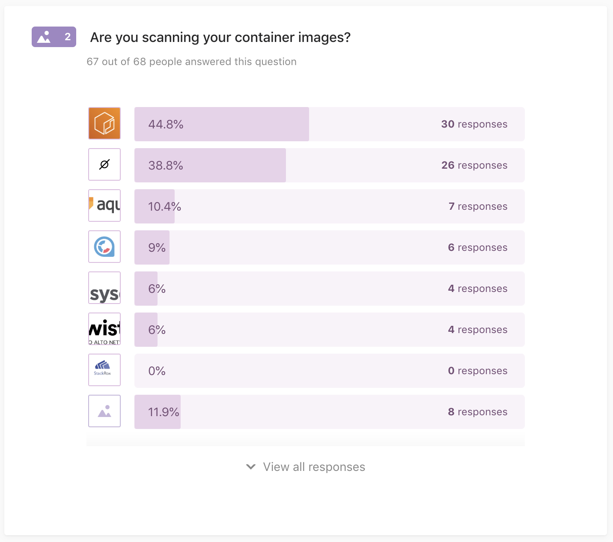

## Q3: Are you scanning containers at runtime?

*68 out of 68 people answered this question*

Performing dynamic container scanning, as part of the container orchestrator, using:

- CNCF Falco
- NeuVector
- Nope, not scanning containers (yet)

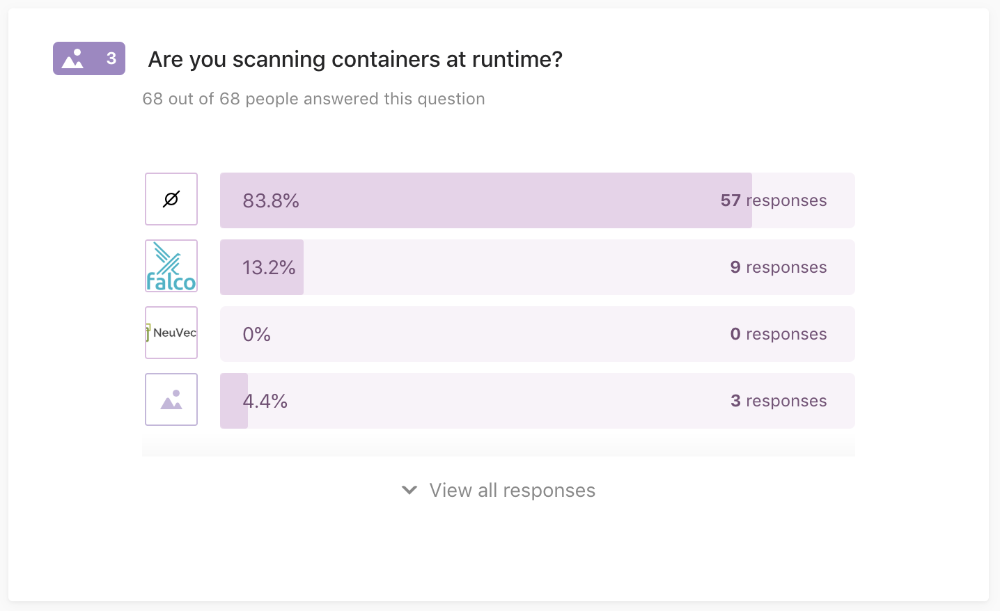

## Q4: How are you managing sensitive data?

*67 out of 68 people answered this question*

Keeping sensitive data, such as passwords, API keys, etc. safe using:

- AWS Secrets Manager
- AWS Parameter Store
- HashiCorp Vault
- DIY encryption
- Nope, not encrypting sensitive data (yet)

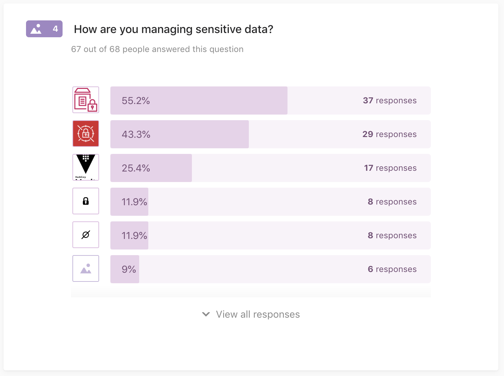

## Q5: Are you signing container images?

*68 out of 68 people answered this question*

Signing container images cryptographically using:

- CNCF Notary
- CNCF TUF-based
- Nope, not signing my images (yet)

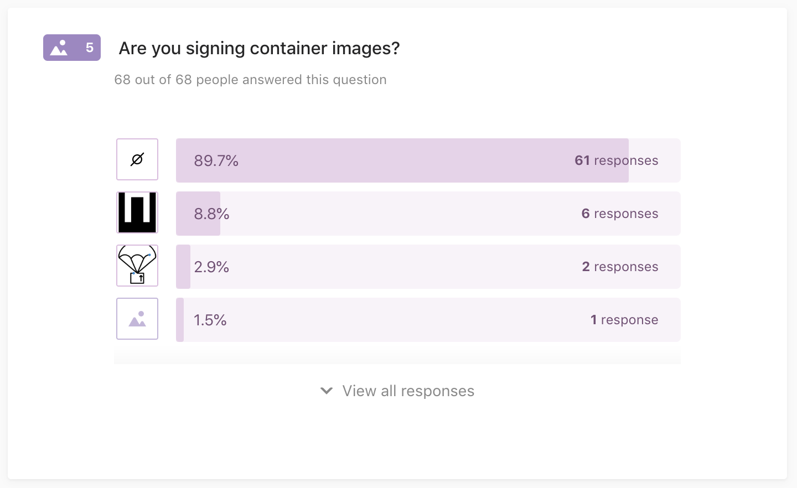

## Q6: How are you managing your supply chain?

*66 out of 68 people answered this question*

The artefacts, such as container images, along the supply chain are managed using:

- CNCF in-toto
- Grafeas
- Nope, not managing my supply chain (yet)

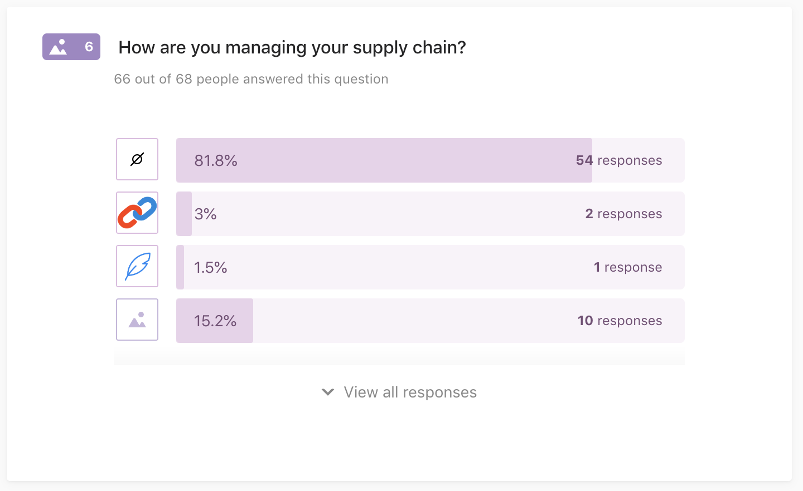

## Q7: Are you using Kubernetes?

*68 out of 68 people answered this question*

If the answer to Q7 was "Yes", the following questions were asked, additionally:

## Q8: Kubernetes: network policies

*30 out of 68 people answered this question (with multiple choice)*

The artefacts, such as container images, along the supply chain are managed using:

- Weave Net
- Calico
- Cilium
- DIY eBPF
-  Via a service mesh

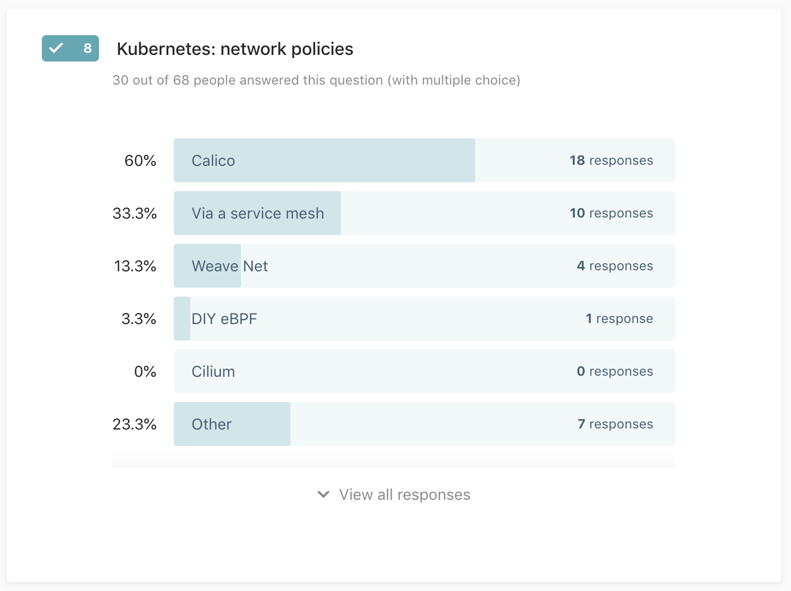

## Q9: Kubernetes: pod security policies

*39 out of 68 people answered this question*

I am already using (or in the process of introducing) PSP.

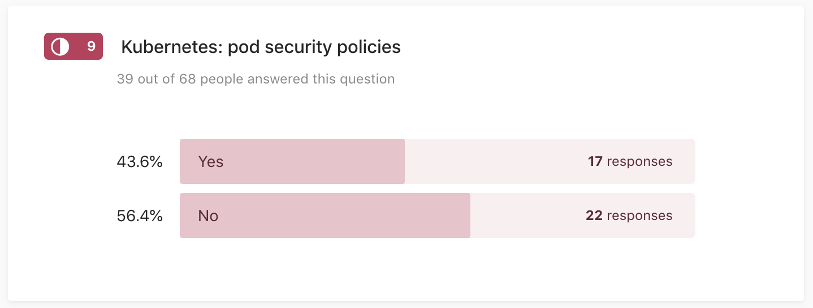

## Q10: Kubernetes: user management

*38 out of 68 people answered this question (with multiple choice)*

To manage user identities I'm using:

- IAM users/roles
- Active Directory/LDAP
- SSO (OpenID Connect/dex, etc.)

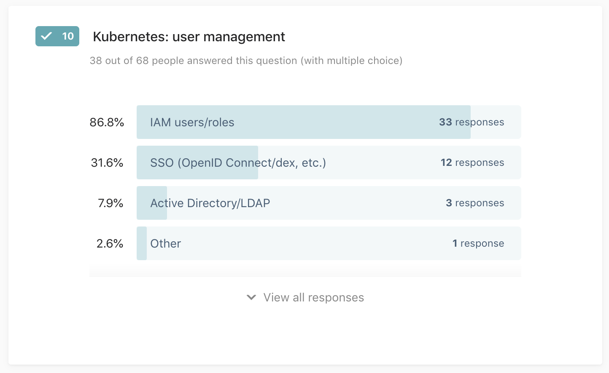

## Q11: Kubernetes: pod-level IAM roles

*39 out of 68 people answered this question*

When using AWS services from apps running on Kubernetes, I'm using:

- IAM roles for service accounts
- `kube2iam`
- `kiam`
- None, I'm assigning the IAM role to the nodes

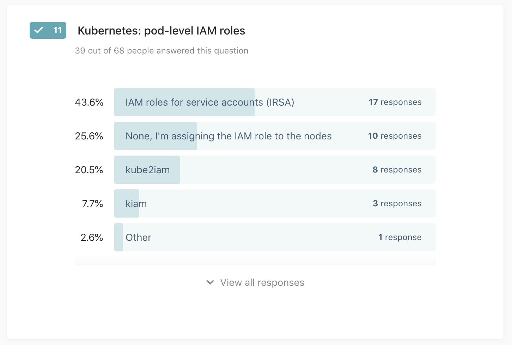

## Q12: Any other security-related feature of AWS you're using? Any container security tool?

This is a free-form comment, so feel free to share any other tool you're 
evaluating or already using. For example, Firecracker for multi-tenancy or 
`audit2rbac` for generating RBAC roles or maybe you're implementing GitOps 
(such as Flux) to strengthen your security posture?

*30 out of 68 people answered this question*

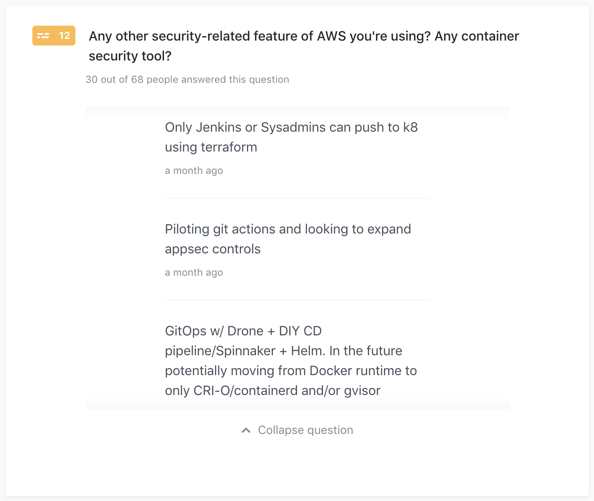

## Q13: My role in the team/organization is …

*44 out of 68 people answered this question*

- Mainly operations
- Mainly development
- InfoSec
- SRE
- Release management
- Testing/QA
- Architect

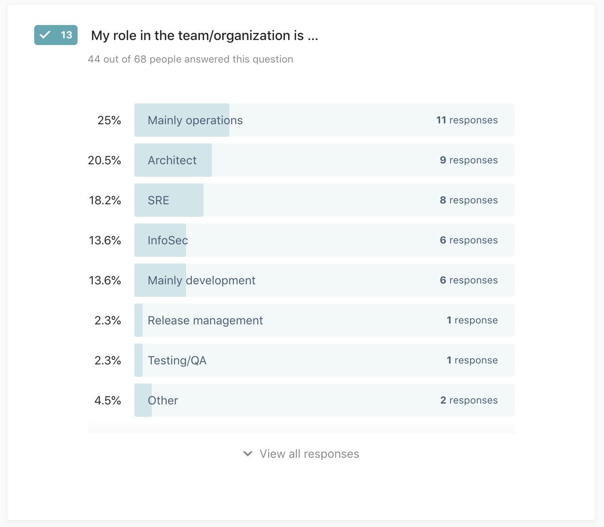